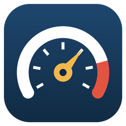

# K-line Logger

Live data and datalogging for Kawasaki personal watercraft through the KDS diagnostic port. It reads sensor values from the ECU over a USB K-line cable, shows them as gauges and a chart, and records CSV logs. A built-in PID scanner helps find what each ECU reports.

Not affiliated with or endorsed by Kawasaki. Channel scalings marked "unverified" haven't been checked against a known-good reading yet.

## Install (Windows)

1. Download [KlineLogger-Setup.exe](../../releases/latest/download/KlineLogger-Setup.exe) (always the newest version).
2. Run it. It installs just for your user, so it doesn't need admin rights. The installer isn't code-signed, so Windows may say "Windows protected your PC": click **More info**, then **Run anyway**.
3. Open **K-line Logger** from the desktop icon or the Start menu.

Settings and channels are stored in `%APPDATA%\K-line Logger`, and logs go to `Documents\K-line Logger\logs`. Uninstalling leaves both in place.

## Run from source

1. Install Python 3.9 or newer from python.org. Tick "Add python.exe to PATH" in the installer.
2. Open a command prompt in this folder and run `pip install -r requirements.txt`.
3. Run `python selftest.py` to check everything against a simulated ECU (no ski needed).
4. Run `python kawasaki_logger.py`, or double-click `run_logger.bat`.

When run from source, settings, channels and logs are kept in this folder.

## Build the installer

1. Install [Inno Setup 6](https://jrsoftware.org/isdl.php).
2. With your Python environment active, run `build_windows.bat` in this folder. It installs PyInstaller, builds the app into `dist\KlineLogger`, then builds `installer\KlineLogger-Setup.exe`.
3. For a new release, raise the version in two places: `APP_VERSION` in `kawasaki_logger.py` and `AppVersion` in `installer.iss`. Then attach the new installer to a GitHub Release, keeping the file name `KlineLogger-Setup.exe` and not marking it as a pre-release. The download link always serves the newest release.

**Speed tip for FTDI cables:** Device Manager → Ports → USB Serial Port → Properties → Port Settings → Advanced → set Latency Timer to 1 ms. The default 16 ms adds a delay to every request.

## First connection

1. Pick **Demo** as the cable and press Connect to see how everything works.
2. Plug the Kawasaki 4-pin adapter into the ski's diagnostic port and the OBD end into the USB cable.
3. Wake the ECU (key on / press start). The cable shows up in the Cable list on its own a couple of seconds after you plug it in (usually as `COMx  USB Serial Port`). Press Connect.

Supported cables: USB K-line cables that show up as a serial port, such as KKL 409.1 cables with an FTDI chip. J2534 pass-thru devices like the Tactrix OpenPort 2.0 don't show up as a serial port and aren't supported yet.
4. If the status says "Waiting for the ECU", the app keeps retrying every 2 seconds. It also reconnects on its own if the ECU drops out, for example during cranking.

## Pages

**Live data.** One tile per channel with the value, a gauge bar, and the low/high seen since connecting. Values turn grey when the ECU isn't connected, so stale numbers are obvious. The **°F / °C** switch at the right of the toolbar changes the temperature tiles, the chart and any new logs; it locks while a log is recording so one file never mixes units, and your choice is remembered. Press **Chart** on a tile (or click anywhere on it) to add it to the chart below. Every charted channel gets its own lane on a shared time axis, so there's no limit and nothing gets bumped off. **Chart all** and **Clear** are at the top of the chart, along with a 15/30/60 second window. Your chart picks are remembered between sessions. Start logging (Ctrl+L) writes a CSV into the `logs` folder named with the date and your run name; while it records, the button turns red and a timer and row count run under it. Press F2 or Add marker to drop a marker (M1, M2...) into the log, handy at the start of a WOT pull. The marker also shows on the chart.

**Channels.** The list of PIDs to read and how to convert them. Double-click to edit; the Notes box in the editor wraps and scrolls. Gauge low/high set each tile's bar (leave blank to scale it to the values seen). "Read every" sets priority: 1 means every update (RPM, throttle), 10 or 20 means occasionally (temperatures, battery). Fewer channels on 1 = faster updates. Channels can't be edited while logging, so a log's columns never change partway through.

**PID scanner.** Scan asks the ECU for every PID in a range and lists the ones that answer, with the bytes as a decimal Value. To find which PID is a given sensor, select a few rows (or none, to watch everything), press **Watch**, change what that sensor measures, then click the **Swing** heading to sort the biggest movers to the top. Swing is how far a value moved, as a percent of its high, so real sensors stand out from one-bit noise. Low, High and Changes restart each time you press Watch, and watching fewer rows reads them faster. Click any heading to sort by it. Select rows and press "Add selected as channels" to name and scale them, and Save results writes everything to CSV.

**Console.** Send any request in hex (header and checksum are added for you) and see every frame on the bus. "Save bus traffic to a file" writes a timestamped TX/RX log, useful for comparing against PulseView captures.

**Settings.** ECU address (auto by default: tries 0x11, then 0x28), wake-up method, baud, timing, and the optional high-speed switch. Connecting saves them. "Show advanced tools" shows or hides the PID scanner, the console and the raw bytes on tiles; turn it off for a simpler window. Hover over a button or a badge to see what it does.

## Formulas

Each channel's formula turns the data bytes into a number:

| Name | Meaning |
|---|---|
| `A`, `B`, `C`... | First, second, third data byte (after the PID echo) |
| `raw` / `sraw` | All data bytes as one big-endian number, unsigned / signed |
| `n` | Number of data bytes |

Functions: `abs min max round int float signed(value, bits) math.*`.

**Temperatures:** write the formula so it gives degrees C and set the channel's Units to `°C`. That channel then follows the °F / °C switch everywhere. A channel with any other units is shown exactly as its formula gives it. Examples: `A*100 + B`, `(A - 48) / 1.6`, `raw * 100 / 655`, `signed(raw, 16) / 10`.

**Calibrating to 0-100 %.** In a channel's Edit window, connect, press **Capture 0 %**, and hold the throttle closed for 3 seconds. Then press **Capture 100 %** and hold it wide open. The formula, units and gauge are filled in for you; press Save channel. It also works for reversed sensors and for any other channel with two known end points.

The starting channels come from Kawasaki **motorcycle** KDS community lists and are marked unverified. Tick "Scaling checked" once a channel matches a known-good reading. Logs always include raw byte columns, so a log can be re-scaled later if a formula turns out wrong.

## Protocol notes

| Step | Request | Expected reply |
|---|---|---|
| Wake-up | 25 ms low, 25 ms high | |
| Start communication | `81 11 F1 81 04` | `80 F1 11 03 C1 EA 8F BF` |
| Start diagnostic session | `80 11 F1 02 10 80 14` | `80 F1 11 02 50 80 54` |
| Read PID 0x09 | `80 11 F1 02 21 09 AE` | `80 F1 11 04 61 09 <A> <B> <cs>` |
| Keep-alive | `3E 01` | `7E` |

Everything runs at 10400 baud. The 62500 baud rate in the project notes was seen during the SXR160 bulk ROM read, where the tool switched speeds for the transfer. If the request that triggers that switch is identified in a capture, enter it in Settings → High-speed switch request, and the app will send it after the session starts and change its own baud to match.

Kawasaki ECUs ignore requests sent faster than roughly 50 ms apart, so the default gap is 55 ms. The ECU address is usually 0x11; some Kawasaki ECUs use 0x28, which is why auto tries both.

## Troubleshooting

- **No answer at all.** Make sure the ECU is awake. Leave ECU address on auto. Try the 360baud wake-up method. Check the adapter pinout: the K-line should land on OBD pin 7, ground on 4/5, and +12 V on 16.
- **"Cable did not echo the request".** Most USB K-line cables power their line driver from OBD pin 16. If the 4-pin adapter doesn't put battery voltage on pin 16, the cable can't drive the line.
- **The SXR160's diagnostic connector has two KDS comm wires** (ECU pins 10 and 14). If one doesn't respond, the adapter may be routing the other one to pin 7.
- **The cable is ELM327-based** (it answers `ELM327 v1.5` to `ATZ` in a terminal). This app drives the K-line directly and needs a raw KKL/FTDI-style cable. An ELM327 mode can be added.
- **The ski shuts itself off.** Kawasaki ECUs power down after about 30 seconds with the engine not running. The logger shows "Waiting for ECU" and reconnects by itself when you take the key out and put it back in.
- **"Lost the USB cable".** Windows reported the cable's port as gone or unusable (unplugged, reset, or a power glitch). Plug it back in and the logger reconnects on its own. If Windows gives it a new COM number, press Disconnect and pick the new one. To stop Windows powering the cable down: Device Manager, Ports, USB Serial Port, Properties, Power Management, untick "Allow the computer to turn off this device".
- **Values look wrong.** The formula is probably wrong for this ECU, not the data. Check the raw bytes on the tile and fix the formula.

## Files

| File | What it is |
|---|---|
| `kawasaki_logger.py` | The app (GUI) |
| `kline.py` | Protocol, logging, scanner and the simulated ECU, no GUI code |
| `pids.json` | Default channel list |
| `selftest.py` | Checks the install against the simulated ECU |
| `assets/` | App icon and header logo |
| `KlineLogger.spec` | PyInstaller recipe for the Windows app |
| `installer.iss` | Inno Setup script for the installer |
| `build_windows.bat` | Builds the app and the installer in one step |
| `LICENSE` | MIT license |

## License

MIT, see [LICENSE](LICENSE). The Windows installer also bundles Python, Tcl/Tk, CustomTkinter and pyserial, which are open source under their own licenses.
